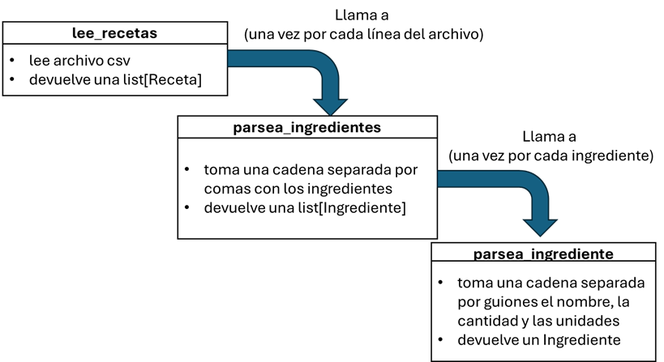

# Proyecto LAB_Recetas
Autor: Daniel Mateos

Revisores: Alfonso Bengoa, Toñi Reina

Adaptación para laboratorio:Daniel Mateos, Alfonso Bengoa, Toñi Reina

Este proyecto es una adaptación del primer parcial del curso 2023/24 para trabajar con tratamientos secuenciales, máximos, mínimos y ordenaciones.


### Condiciones Iniciales:
Se facilita una carpeta **data** con el fichero denominado ``recetas.csv`` con datos sobre recetas culinarias. Ábralo para ver su estructura. 

Cree una carpeta **src** para incluir los siguientes módulos Python:

* **recetas.py** en el que implemente las funciones que se indican a continuación.

* **recetas_test.py** en el que incluirá las sentencias necesarias para ir probando las funciones a medida que las implemente. Por cada función implementada debe definir una función de test con los parámetros adecuados.

Las primeras líneas del fichero se muestran a continuación:
```
denominacion;tipo;dificultad;ingredientes;tiempo;Calorias;Fecha creación;precio estimado
Ensalada de Frutas;Postre;Baja;fresas-5-u,piña-0.25-u,kiwi-1-u,menta-50-cl,zumo naranja-100-cl;15;120;14/01/2024;7,5
Spaghetti Bolognese;Plato principal;Media;pasta-200-gr,carne picada-250-gr,tomate frito-150-gr,cebolla-0.5-u,dientes ajo-4-u;45;400;09/01/2024;12,5
Sopa de Tomate;Entrante;Baja;tomate-3-u,cebolla-1-u,dietes ajo-4-u,caldo de verduras-500-cl,albahaca-10-gr;35;120;29/01/2024;8,5
Gazpacho;Entrante;Baja;;25;120;10/02/2024;6,95
```

En cada línea se muestra la siguiente información:

**NOTA**: Observe en el fichero que los ingredientes están compuestos por tres campos y que a alguna receta le faltan los ingredientes.
```
• denominacion:  denominacion de la receta.
• tipo: tipo de receta (Postre, Plato principal etc).
• dificultad: dificultad de elaboración (Baja, Media, Alta).
• ingredientes: ingredientes de la receta. Cada ingrediente lleva su nombre, la cantidad y las unidades con las que se confecciona la receta (u=unidades/gr=gramos/cl=centilitros)
• tiempo de preparación: tiempo de elaboración en minutos.
• calorias: número de calorias de una porción.
• fecha de creación: fecha en la que se añadió la receta al dataset.
• precio estimado: precio por persona.
```

## Definición de tipos de datos
### Ejercicio 1 

Copie en receta.py los siguientes NamedTuple e importe los tipos y funciones que necesite:
```
Ingrediente = NamedTuple("Ingrediente",
					[("nombre",str),
					 ("cantidad",float),
					 ("unidad",str)])
						 
Receta = NamedTuple("Receta", 
                    [("denominacion", str),
                     ("tipo", str),
                     ("dificultad", str),
                     ("ingredientes", List[Ingrediente]),
                     ("tiempo", int),
                     ("calorias", int),
                     ("fecha", date),
                     ("precio", float)])

```

## Carga de datos

### Ejercicio 2
Defina una función ``lee_recetas`` que reciba como parámetro el nombre de un fichero con la estructura de ``recetas.csv`` y devuelva una lista de tuplas de tipo **Receta** con los registros leídos del fichero.

Para implementar esta función descomponga el problema en tres funciones: la propia ``lee_recetas`` y dos funciones auxiliares, ``parsea_ingredientes`` y ``parsea_ingrediente``. Para cada línea del fichero (excepto la primera) se debe crear una tupla de tipo **Receta**, y para ello, ``lee_recetas`` se apoyará en la función auxiliar ``parsea_ingredientes``, que es la responsable de construir una lista de tuplas de tipo **Ingrediente** a partir de una cadena que contenga los datos de los ingredientes. Finalmente, ``parsea_ingredientes`` se apoyará en la función auxiliar ``parsea_ingrediente``, que se encargará de crear un **Ingrediente** a partir de una cadena con los datos del mismo. Fíjese en el siguiente esquema:




Resultados esperados en el test:
```
test_lee_recetas
Registros leídos: 30
Los dos primeros: [Receta(denominacion='Ensalada de Frutas', tipo='Postre', dificultad='Baja', ingredientes=[Ingrediente(nombre='fresas', cantidad=5.0, unidad='u'), Ingrediente(nombre='piña', cantidad=0.25, unidad='u'), Ingrediente(nombre='kiwi', cantidad=1.0, unidad='u'), Ingrediente(nombre='menta', cantidad=50.0, unidad='cl'), Ingrediente(nombre='zumo naranja', cantidad=100.0, unidad='cl')], tiempo=15, calorias=120, fecha=datetime.date(2024, 1, 14), precio=7.5), Receta(denominacion='Spaghetti Bolognese', tipo='Plato principal', dificultad='Media', ingredientes=[Ingrediente(nombre='pasta', cantidad=200.0, unidad='gr'), Ingrediente(nombre='carne picada', cantidad=250.0, unidad='gr'), Ingrediente(nombre='tomate frito', cantidad=150.0, unidad='gr'), Ingrediente(nombre='cebolla', cantidad=0.5, unidad='u'), Ingrediente(nombre='dientes ajo', cantidad=4.0, unidad='u')], tiempo=45, calorias=400, fecha=datetime.date(2024, 1, 9), precio=12.5)]

Los dos últimos: [Receta(denominacion='Sopa de Champiñones', tipo='Entrante', dificultad='Baja', ingredientes=[Ingrediente(nombre='champiñones', cantidad=200.0, unidad='gr'), Ingrediente(nombre='cebolla', cantidad=0.75, unidad='u'), Ingrediente(nombre='dientes ajo', cantidad=3.0, unidad='u'), Ingrediente(nombre='caldo de pollo', cantidad=500.0, unidad='cl'), Ingrediente(nombre='perejil', cantidad=10.0, unidad='gr')], tiempo=30, calorias=180, fecha=datetime.date(2024, 2, 27), precio=8.5), Receta(denominacion='Arroz con Pollo', tipo='Plato principal', dificultad='Baja', ingredientes=[Ingrediente(nombre='arroz', cantidad=150.0, unidad='gr'), Ingrediente(nombre='pollo',cantidad=1.0, unidad='u'), Ingrediente(nombre='cebolla', cantidad=1.0, unidad='u'), Ingrediente(nombre='pimiento', cantidad=1.0, unidad='u'), Ingrediente(nombre='azafrán', cantidad=5.0, unidad='gr')], tiempo=40, calorias=380, fecha=datetime.date(2024, 2, 6), precio=14.99)]
```
## Tratamientos secuenciales simples

### Ejercicio 3
Defina una función ``ingredientes_en_unidad`` que reciba como parámetros una lista de tipo Receta y una unidad de medidas de los ingredientes de tipo str, que puede tomar el valor **None**, devuelva el número  ingredientes **distintos** que se han medido en la unidad dada. Si la unidad es **None**, entonces se devolverá el número de ingredientes distintos, independientemente de la unidad.

Resultados esperados en el test:
```
test_ingredientes_en_unidad
Hay 68 ingredientes distintos que se miden en None.
Hay 33 ingredientes distintos que se miden en gr.
Hay 11 ingredientes distintos que se miden en cl.
```
### Ejercicio 4
Defina una función ``recetas_con_ingredientes`` que reciba como parámetros una lista de tipo Receta, un conjunto con nombres de ingredientes y devuelva una lista de tuplas con las denominaciones, las calorías y los precios de las recetas que entre sus ingredientes existe alguno de los dados como parámetro.

**Nota** Tenga en cuenta que si la receta tiene más de uno de los ingredientes dados, solo debe aparecer una vez.

Resultados esperados en el test:
```
test_recetas_con_ingredientes
Las recetas con alguno de los siguiente ingredientes {'harina', 'azúcar'} son: [('Mousse de Chocolate', 300, 9.5), ('Galletas de Avena', 150, 7.95), ('Pastel de Zanahoria', 300, 13.5), ('Muffins de Arándanos', 180, 7.95)]

Las recetas con alguno de los siguiente ingredientes {'pimiento', 'tomate', 'cebolla'} son: [('Spaghetti Bolognese', 400, 12.5), ('Sopa de Tomate', 120, 8.5), ('Risotto de Champiñones', 320, 13.99), ('Hamburguesa con Queso', 500, 11.25), ('Sopa de Calabaza', 150, 9.95), ('Gazpacho Andaluz', 150, 7.95), ('Bruschetta', 160, 7.25), ('Caponata', 160, 9.99), ('Ensalada de Atún', 180, 9.25), ('Pollo al Curry', 400, 15.75), ('Tortilla Española', 320, 11.25), ('Sopa de Champiñones', 180, 8.5), ('Arroz con Pollo', 380, 14.99)]
```

## Máximos, mínimos y ordenaciones

### Ejercicio 5
Defina una función ``receta_mas_barata`` que reciba como parámetros una lista de tipo Receta, un conjunto con tipos de recetas y un parámetro `n` de tipo entero con valor por defecto **None**, y devuelva la receta más barata de entre las `n` recetas con menos calorias de alguno de los tipos de receta dados como parámetro. Si n toma el valor **None** se buscará la receta más barata de entre todas las recetas.
Resultados esperados en el test:
```
test_receta_mas_barata
La receta más barata de alguno de los siguientes tipos {'Postre', 'Entrante'} es:
 Receta(denominacion='Gazpacho', tipo='Entrante', dificultad='Baja', ingredientes=[], tiempo=25, calorias=120, fecha=datetime.date(2024, 2, 10), precio=6.95)

La receta más barata de alguno de los siguientes tipos {'Postre', 'Plato Principal'} entre las 5 con menos calorías es:
 Receta(denominacion='Ensalada de Frutas', tipo='Postre', dificultad='Baja', ingredientes=[Ingrediente(nombre='fresas', cantidad=5.0, unidad='u'), Ingrediente(nombre='piña', cantidad=0.25, unidad='u'), Ingrediente(nombre='kiwi', cantidad=1.0, unidad='u'), Ingrediente(nombre='menta', cantidad=50.0, unidad='cl'), Ingrediente(nombre='zumo naranja', cantidad=100.0, unidad='cl')], tiempo=15, calorias=120, fecha=datetime.date(2024, 1, 14), precio=7.5)
```
### Ejercicio 6
Defina una función ``recetas_baratas_con_menos_calorias`` que reciba como parámetros una lista de tipo Receta y un parámetro `n` y devuelva una lista de tuplas, cada una con la denominación y las calorías de las `n`recetas con menos calorías. Las tuplas serán seleccionadas de aquéllas cuyo precio no supera el precio medio de todas las recetas en la lista.

Resultados esperados en el test:

```
test_recetas_baratas_con_menos_calorias

Las 3 recetas con menos calorías con precio menor que el promedio son:
        ('Ensalada de Frutas', 120)
        ('Sopa de Tomate', 120)
        ('Gazpacho', 120)

Las 5 recetas con menos calorías con precio menor que el promedio son:
        ('Ensalada de Frutas', 120)
        ('Sopa de Tomate', 120)
        ('Gazpacho', 120)
        ('Brócoli al Vapor', 120)
        ('Sopa de Calabaza', 150)
```